## 花卉生产管理系统
- 系统平台：Windows 10 家庭中文版
- Qt:

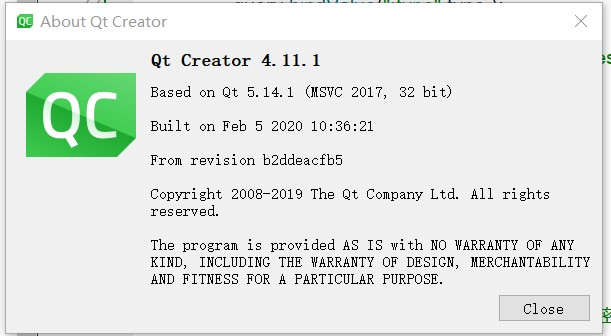

- 数据库： MySQL 8.0.25

### 项目要求

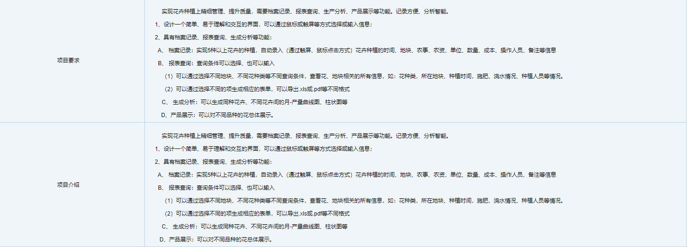


### 项目模块介绍

- tcp_file_server 为文件发送服务端 ：文件传输需要设置监听端口（使用ipconfig命令查看本地ip地址），并提前监听
- tcpserver为消息发送服务端 ：消息发送功能需要服务端提前监听

- 对应客户端已集成到项目中：tcp消息发送，文件传输需要在系统设置页面设定可用ip地址，且服务端提前监听，无正确ip地址连接失败

- 功能主体模块
    - 登录
    - 产品展示
	- 档案记录
	- 报表查询
	- 地图管理
	- 生产分析
	- 系统设置
- 附加功能:
	- 生产日历:支持农历查询
	- 天气助手：支持花卉所在地天气状况查询(目前仅信阳），更新时间为1小时
	- 消息帮助：支持同一局域网内消息沟通，帮助

### 项目启动帮助

**重点**：默认您的电脑应该配置好QT能够成功连接MySQL数据库，若尚未配置或者尚未确定，请自行写代码确认
- QT连接MySQL数据库方式：
  - 自编译数据库驱动
  - 采用ODBC驱动
- 执行数据库SQL文件：在自己的电脑数据库软件上执行flowermanagment.sql生成花表和用户表 
- 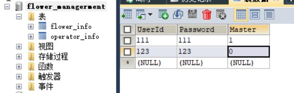
  
- QT配置数据库: 更改global.cpp中数据库连接设置：
  
  

- 编译启动
  - 如遇到qchart_xxxx.h找不到，请删除#include<qcart_xxx.h>中的qchart

### 启动步骤

1.  启动tcp_file_server ，并设置监听  ————注意监听地址及端口  ------修改源码的ip地址为本地的ip
2.  启动消息服务端tcpserver，并设置监听------可选
3.  启动主项目
    - 登录  -------需要提前知晓帐号信息，无帐号信息不能登录 ，不能在登录界面注册新用户  -----保护系统信息安全
  
    

4. 进入主界面：
	- 产品展示，档案记录，报表查询，地图管理，生产分析，系统设置,生产日历,天气助手,消息帮助,退出登录,退出系统

#### 产品展示
分析五种花卉的成本、生长情况、浇水情况、施肥情况、供需情况等  

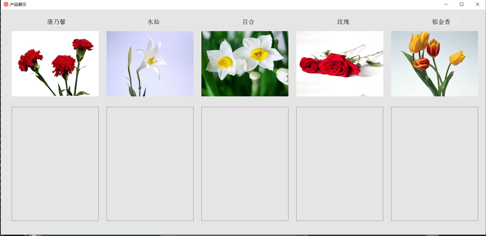

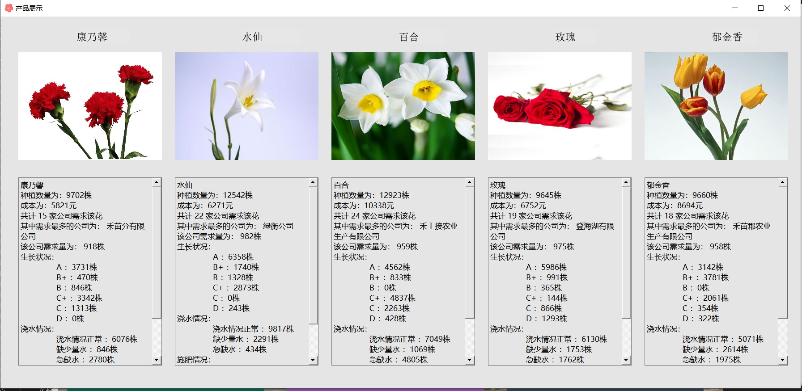

#### 档案记录
档案记录示例：
```
##目前仅支持判空，不支持对各种非法输入的判断
## 位置是根据经纬度定位的
花种：请选择花种
农事：测试功能
农资：待定
位置1：113.92085933675140,32.14876133063608
位置2：113.92115933675150,32.148817322259280
位置3：113.92110933675140,32.14901133063600
位置4：113.92092009954840,32.149061330636045
种植单位：哇哈哈公司
联系人：小邱
联系电话：19921845251
数量：500
单价：0.6
备注：急
```
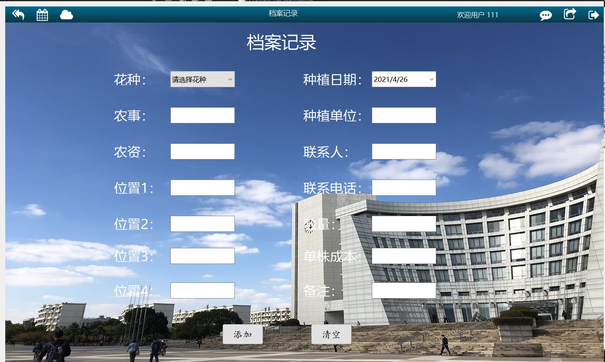

#### 报表查询:
功能要点：
   - 支持任意字段，精确，模糊查询
   - 支持查询时任意字段排序
   - 支持隐藏某列
   - 支持数据映射
   - 支持表中首尾项，下一项，上一项按钮操作
   - 支持导出查询结果为excel和pdf
   - 支持查询结果文件发送到服务端
  
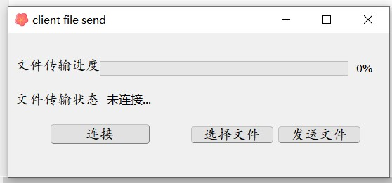


   - 支持管理员删除记录
   - 支持用户更新记录，收割花卉
  


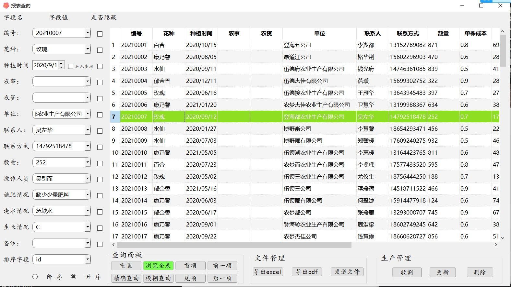

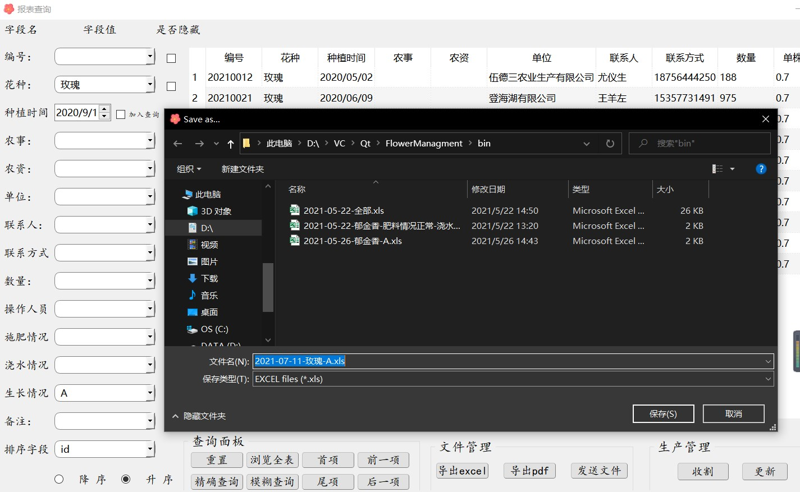

#### 地图管理：
   - 支持花卉地理信息可视化展示
   - 支持地图地理位置显示
  
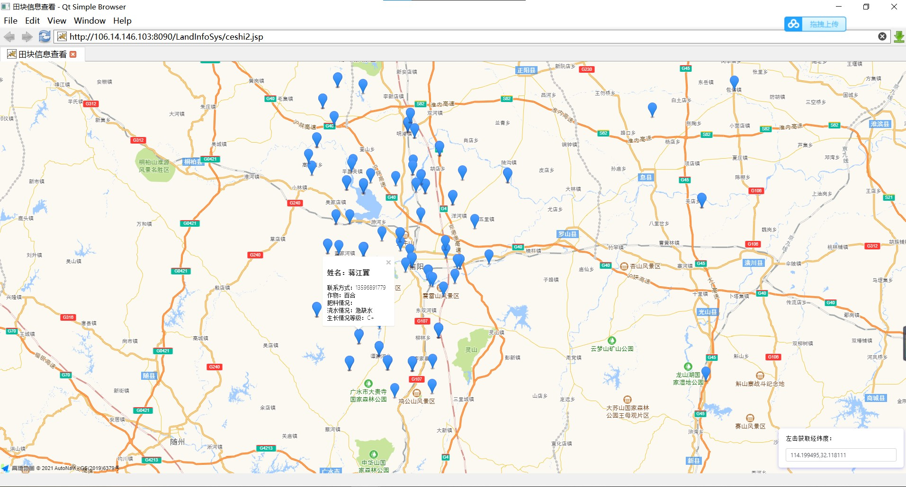
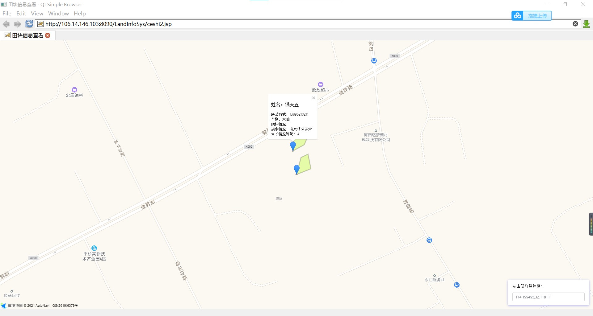

#### 生成分析：
- 支持花卉生长，浇水，施肥情况展示
- 支持同种花卉不同种花卉数量以及需求方数量展示
- 支持饼图，柱状图展示
- 支持点击动画展示效果


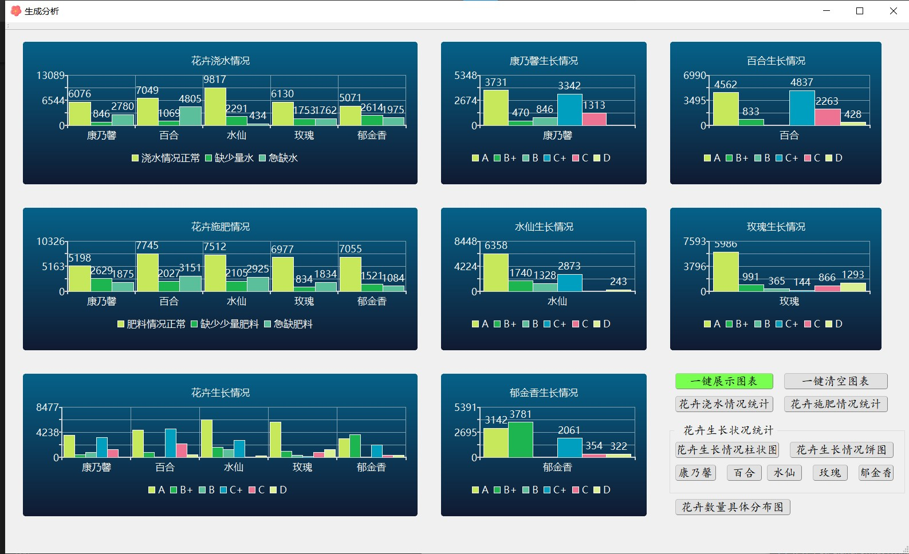
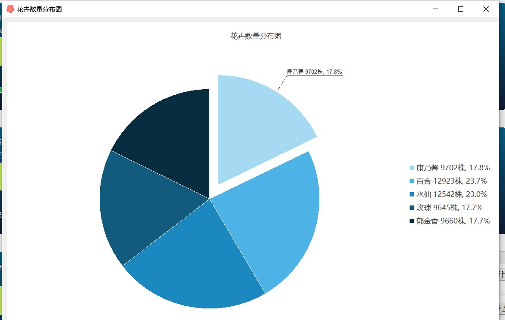
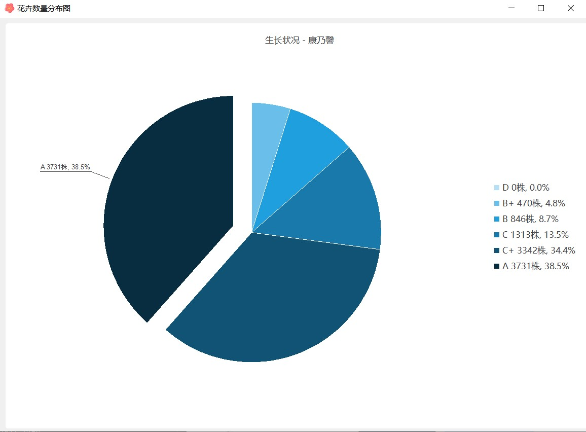
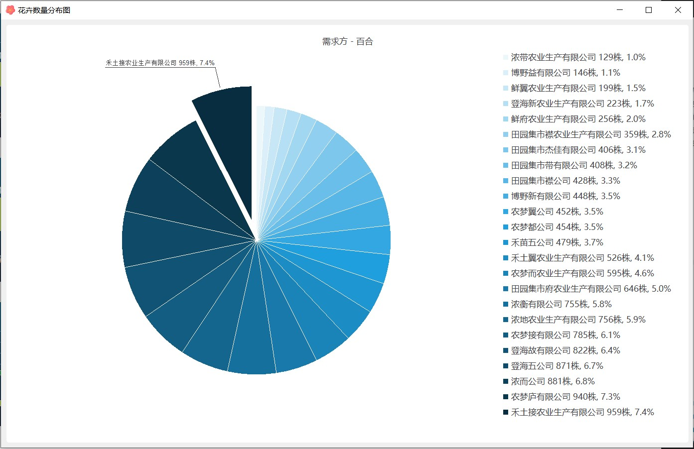

#### 系统设置：
  - 支持管理员添加用户
	    数据库中 1 为管理员，0 为用户
    

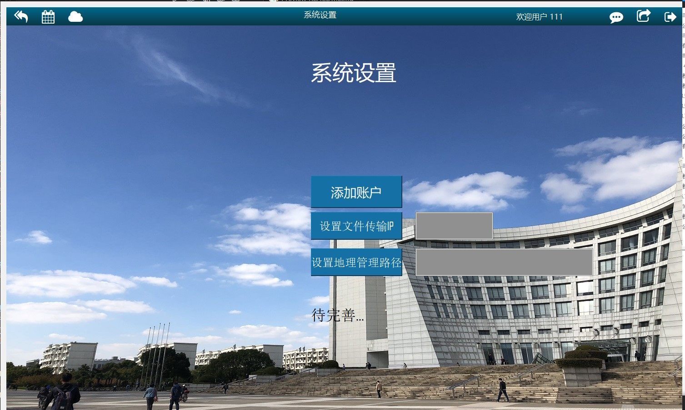
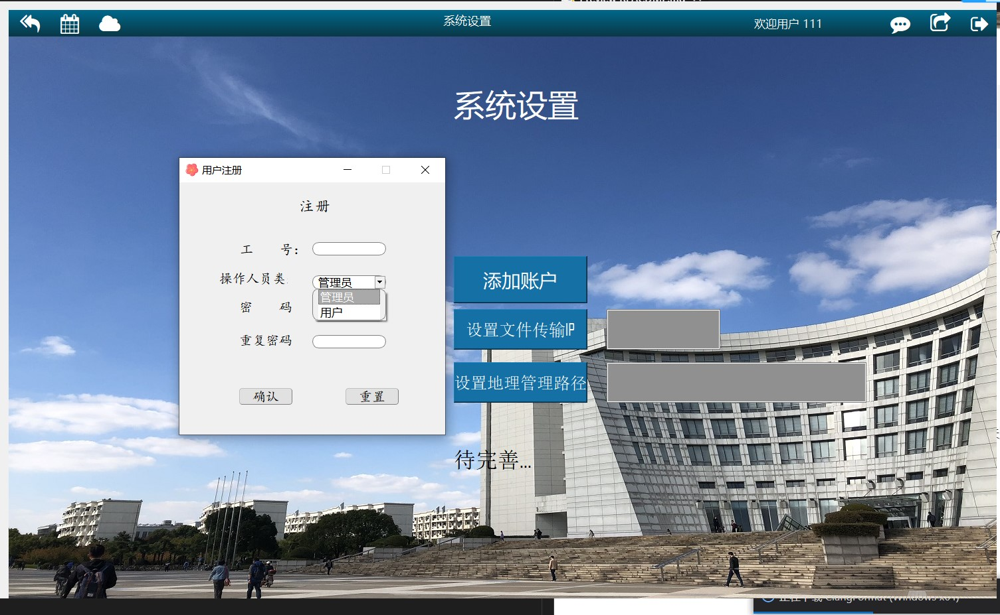

#### 附加功能:
- 生产日历:支持农历查询
  
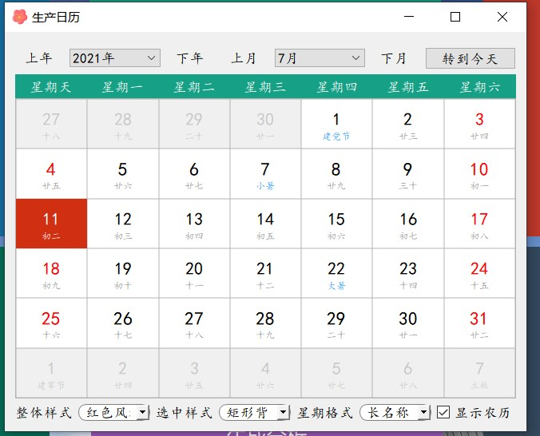

- 天气助手：支持花卉所在地天气状况查询，更新时间为1小时
  
  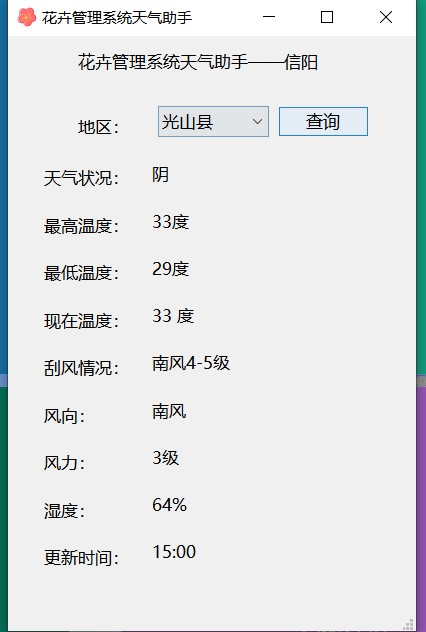

- 消息帮助：支持局域网内消息沟通，帮助
  
  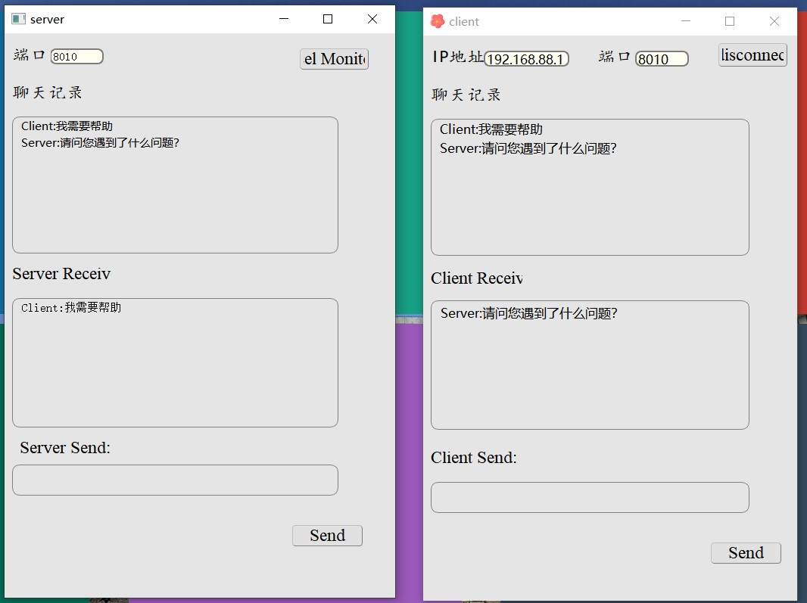

- 操作日志记录：系统生成操作日志，每个一小时更换记录存档
  
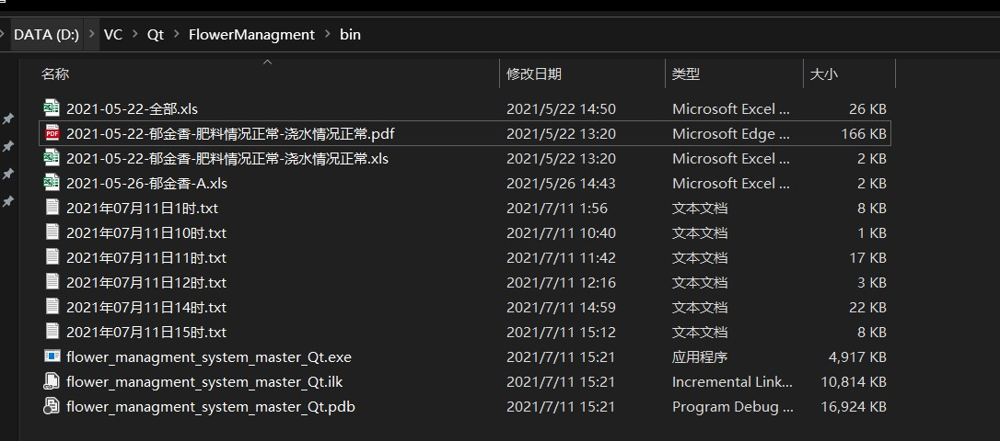

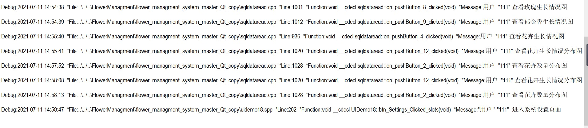

#### 注意
报表查询文件导出路径
服务端接收文件路径:/Files

### 存在问题
- 项目打包发布失败，仅能在能够Qt连接MySQL驱动的机器上运行
- 档案记录非法校验未添加
- 数据库使用单张数据表，大数据量下可考虑分库分表
- 可将文件传输服务与消息帮助服务统一到一个模块
- 消息帮助服务，服务端未使用多线程处理多个客户端连接消息请求
- 项目花卉扩展性不足，仅支持五种花卉的记录管理，不支持新增新的花卉种类信息
- 地图管理服务采用Java项目提供访问接口，两者数据库未进行同步，地图管理页面有待改善

### 其他
- 建议：
    - qcw1992184@163.com
    - QQ : 2098000428
- 问题：
  - 代码中存在若干问题点(我是故意的)，期待您的发现！
- 打赏：

  
  